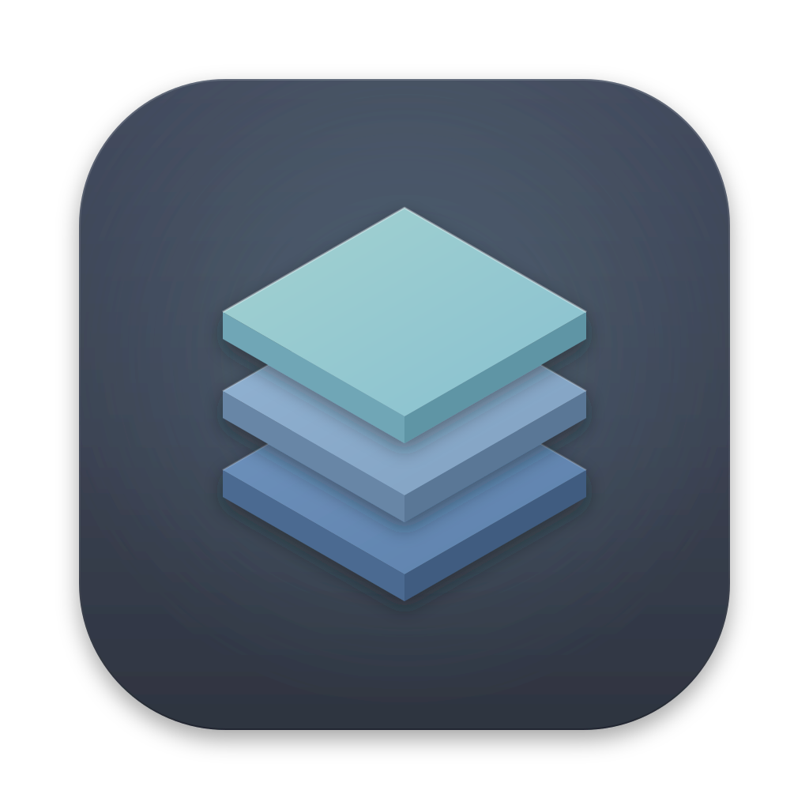
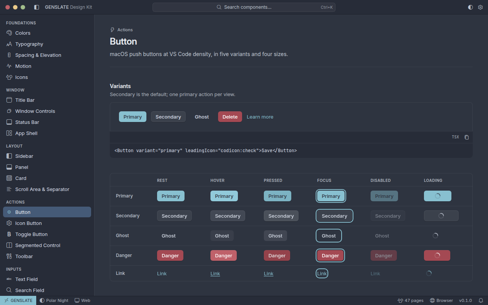

<div align="center">



# GENSLATE

**A family of fast, native desktop apps sharing one beautiful Nord design system.**

Tauri 2 · Rust · React 19 · Base UI · Tailwind CSS v4 — orchestrated by moon, powered by bun.

[Getting started](other/documents/getting-started.md) ·
[Commands](other/documents/commands.md) ·
[Architecture](other/documents/architecture.md) ·
[Design system](other/documents/design-system.md) ·
[Contributing](other/documents/contributing.md)

</div>

---

<p align="center">
  
  <br />
  <sub>The <b>Example · Design Kit</b> app — custom titlebar, component showcase, status bar — in Polar Night.</sub>
</p>

## Highlights

- **Native and light** — Tauri 2 apps with a Rust core; small installers for macOS, Windows and Linux.
- **One design language** — official **Nord** themes (Polar Night dark, Snow Storm light), a modern flat UI with **VS Code density** and **macOS refinement**.
- **Real window chrome** — custom titlebar and status bar everywhere; native traffic lights on macOS (overlay titlebar), pixel-matched custom traffic lights on Windows and Linux; no white flash on launch.
- **Typed end to end** — TypeScript 7 in its strictest mode, typed IPC through `@genslate/tauri-bridge`, strict Rust lints.
- **Tokens as code** — one typed source generates CSS variables, the Tailwind theme, TS, JSON, a WCAG contrast report and Rust constants.
- **Fast feedback** — moon caching and affected-only CI, bun for installs, scripts and tests.

## Quick start

> Prerequisites: [proto](https://moonrepo.dev/proto) and the [Tauri system dependencies](https://v2.tauri.app/start/prerequisites/) for your OS.

```sh
git clone https://github.com/ATOMANGELETTI/GENSLATE.git && cd GENSLATE
proto install      # moon, bun and rust at the versions pinned in .prototools
bun run setup      # dependencies, git hooks, moon schemas
bun run dev        # launch the example app with hot reload
```

## Commands

| Command | Description |
|---|---|
| `bun run setup` | Install dependencies, git hooks and toolchain components |
| `bun run dev` | Run the example desktop app with HMR |
| `bun run build` | Build every project |
| `bun run package` | Build installers into `release/<app>/<version>/` |
| `bun run test` | Run TypeScript and Rust tests |
| `bun run check` | Lint, type-check, spell-check, dead-code, clippy, rustfmt, token drift |
| `bun run format` | Format everything (Biome + rustfmt) |
| `bun run tokens` | Regenerate design tokens |
| `bun run version` | Bump the version everywhere |
| `bun run new-app <name>` | Scaffold a new desktop app |
| `bun run clean` | Remove build output and caches |

Per-project tasks: `bun x moon run <project>:<task>` — see [Commands](other/documents/commands.md).

## Repository layout

```
GENSLATE/
├── desktop/                 Tauri 2 desktop apps
│   ├── example/             Design Kit showcase (the reference app)
│   └── launcher/ terminal/ explorer/ …   reserved for upcoming apps
├── packages/
│   ├── tokens/              Nord design tokens + generator
│   ├── design-system/       React components (Base UI + Tailwind v4 + tailwind-variants)
│   ├── tauri-bridge/        typed window controls, platform, theme sync, IPC
│   ├── config-typescript/   shared tsconfig presets
│   └── config-vite/         shared Vite preset (React Compiler, Tailwind, Tauri)
├── crates/                  shared Rust: design-tokens, paths, testing, core/<app>
├── webapp/                  website (github-page) and servers (tauri-servers)
├── scripts/bun-commands/    one script per root command
├── tests/e2e/               end-to-end tests
├── release/                 packaged installers (git-ignored)
├── other/                   documents, config examples, licenses, logs, resources
├── .config/                 moon, Biome, cspell, knip, commitlint, cargo configs
├── .claude/                 Claude Code settings, hooks, agents, commands, skills, rules
└── .github/                 CI, release and security workflows
```

## Design system

`@genslate/design-system` delivers window chrome (TitleBar, traffic lights, StatusBar, AppShell) and components for layout, actions, inputs, navigation, overlays, feedback and display. Components are built on accessible **Base UI** primitives, styled only with generated token utilities (`bg-surface`, `text-fg-muted`, `h-control-md`, …), and switch between **Polar Night** and **Snow Storm** via `data-theme`, with a `system` option that follows the OS.

13px Inter, 28px controls, 22px tree rows, Codicons at 16px, hairlines at rest and soft macOS depth only on floating layers. Every component handles every state, in both themes, with full keyboard support (WCAG 2.2 AA). Read more in [Design system](other/documents/design-system.md).

## Tech stack

| Area | Technology |
|---|---|
| Monorepo | moon 2.5.5 · bun 1.4.2 (package manager, runtime, test runner) |
| Desktop | Tauri 2.11 · Rust 1.98 (edition 2024) |
| UI | React 19.3 + React Compiler · Vite 8.3 · Base UI 1.8 · Tailwind CSS 4.3 · tailwind-variants 3.3 |
| Language | TypeScript 7.0 (native compiler) |
| Icons & type | VS Code Codicons · Lucide · Inter · JetBrains Mono |
| Quality | Biome 2.5 · cspell · knip · clippy · rustfmt · commitlint · lefthook |
| Testing | bun test · Testing Library · happy-dom · cargo test |
| Security | cargo-deny · CodeQL · dependency review · Dependabot |

## Documentation

| | |
|---|---|
| [Getting started](other/documents/getting-started.md) | [Architecture](other/documents/architecture.md) |
| [Commands](other/documents/commands.md) | [Design system](other/documents/design-system.md) |
| [IPC](other/documents/ipc.md) | [Portability](other/documents/portability.md) |
| [Testing](other/documents/testing.md) | [Release](other/documents/release.md) |
| [Security](other/documents/security.md) | [Contributing](other/documents/contributing.md) |

## License

Proprietary — © 2026 GENSLATE. All rights reserved. See [LICENSE](LICENSE). Third-party notices: [other/licenses](other/licenses/).
